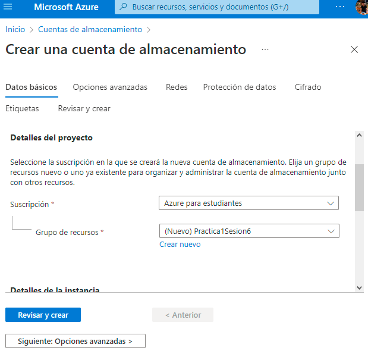
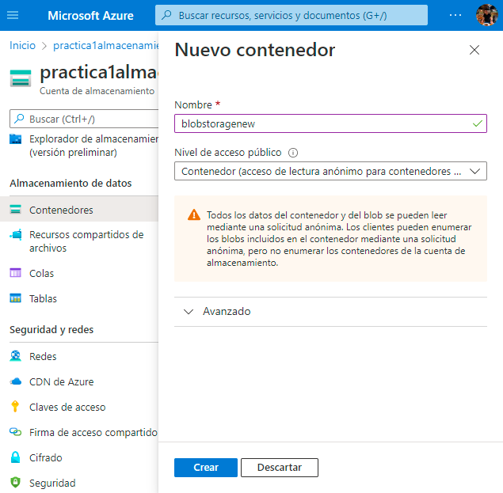
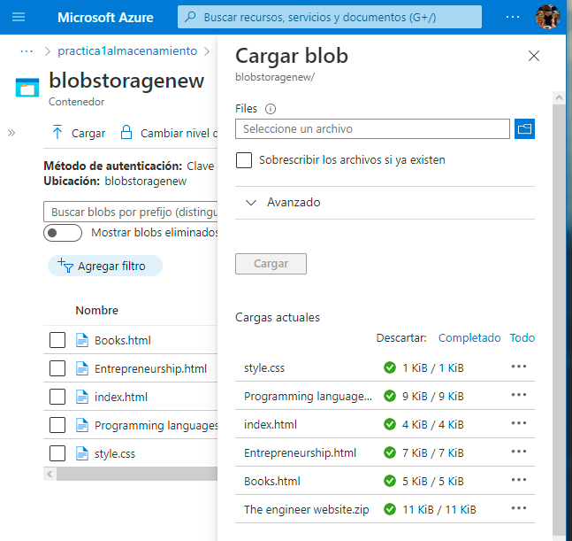
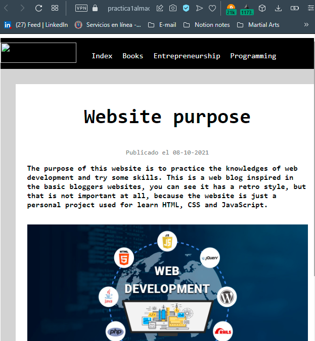

# Practica 1 Sesion 6
Implementación de los servicios de Azure Blob Storage.

- El primer paso es crear un grupo de recursos dentro del servicio de cuentas de almacenamiento.

- Una vez validado y creado el grupo de recursos nos direccionaremos a la seccion de contenedores y procederemos a crear un contenedor.

- Dentro del contenedor podemos importar cualquier cantidad de archivos, en este caso implementamos un conjunto de archivos HTML y esto nos generara un URL mediante el cual podemos ver el archivo importado. En este caso si queremos implementar un sitio estático, buscamos dentro de los servicios de Azure Blob Storage la sección de sitios estáticos y seguimos los pasos para subir archivos y de igual manera nos generara un URL y podremos ver nuestro sitio web estático.

---
*Autor: Rogelio Clemente Balderas*

*Fecha: 10/07/202*

Requisitos:
    
- Azure Storage
- Azure Blob Storage  

---